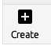
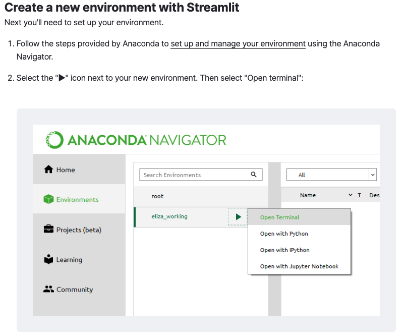
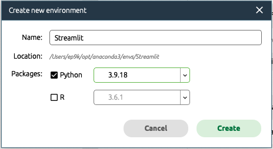
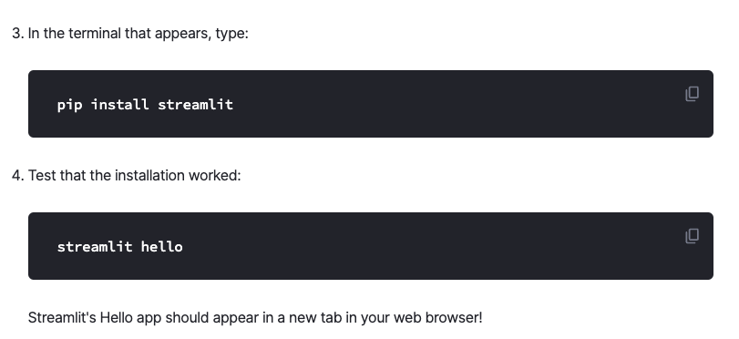

# streamlit_python_workshop

```
Last updated 10/06/23
```

## **About Me**

Erich Purpur

    Research Librarian for Science & Engineering
    epurpur@virginia.edu
    Brown Science & Engineering Library room I046


I'm a part of a group called [research data services](https://data.library.virginia.edu/) and I do these things:
    
    1. Serve as Liaison to various departments in the sciences & engineering
    2. Teach workshops and classes (like this one)
    3. Help people with research projects
    4. Random other things as they come up


## Welcome to the UVA Library
* [Research Data Services](https://data.library.virginia.edu/)
* [Workshop Series](https://data.library.virginia.edu/training/)

## Other Upcoming Workshops

| Workshop | Date | Time |
| ---- | ---- | ---- |
| Intro to Python pt 1                                                |       Tuesday 8/29   |  12:00 - 1:30pm
| Intro to Python pt 2                                                |       Tuesday 9/5    |  12:00 - 1:30pm
| Intro to Version Control w/ Git + Github                            |       Wednesday 9/6  |  1:00 - 2:30pm
| Python Data Analysis + Visualization                                |       Tuesday 9/12  |  12:00 - 1:30pm
| Intro to Regular Expressions                                        |       Wednesday 9/13 |  1:00 - 2:30pm
| Python and APIs                                                     |       Tuesday 9/19   |  12:00 - 1:30pm
| Geospatial Data + Mapping in Python                                 |       Tuesday 9/26   |  12:00 - 1:30pm
| Python Web Dashboards w/ Streamlit                                  |       Tuesday 10/10  |  12:00 - 1:30pm


### Intro to Streamlit

In this workshop we will build some simple web apps and/or data dashboards with [Streamlit](https://streamlit.io/). Streamlit is an open-source python library used for creating web applications for data related purposes including simply displaying your data, data science, and machine learning projects. It is designed to make it easy for programmers to turn data related projects into shareable web applications without requiring extensive web development experience. Streamlit allows you to build interactive data dashboards and visualizations quickly and easiy. 

### Let's Get Started

[Here is a quick example of what these dashboards look like](https://blog.streamlit.io/how-to-build-a-real-time-live-dashboard-with-streamlit/).

Streamlit has a ["Get Started"](https://docs.streamlit.io/library/get-started) page in their documentation that we will be following today for this workshop. 

#### Steps to get started

First, find the "environments" tab in Anaconda Navigator and create a new environment. Look at the bottom left of the Anaconda Navigator and find the "Create" button 



It probably doesn't matter which version of python, but just for the sake of simplicity, choose python 3.9



Then enter the following commands in the terminal window. 



A "Hello" browser window should pop up. If so, Streamlit is running!

### Streamlit Demo
Run the following commands to see a demo streamlit application.
```
pip install --upgrade streamlit

streamlit run https://raw.githubusercontent.com/streamlit/demo-uber-nyc-pickups/main/streamlit_app.py
```

### Conda Environments 
You might be wondering, what is this environment we just created? Basicaly, a conda environment is like a bubble which contains a certain set of softwares and packages for a specific purpose. Environments are really useful to use because it is common to have errors and conflicts when installing packages, such as streamlit. You can read more about conda environments [here](https://conda.io/projects/conda/en/latest/user-guide/tasks/manage-environments.html#activating-an-environment).

### Web Server
As you can see, the "hello" window opened in a tab in your web browser. That means a web server is in use. A web server is a combination of hardware (a computer) and software (a program/code) that stores and displays all the content in a web application or web site. Streamlit does a lot of this without you seeing it. But it is also reading your python code, which we will see later.

### Localhost
Our Streamlit app will run on "localhost". Localhost is like your own computer talking to itself on the internet. It is a way to refer to your own computer when it is running a web server. This is commonly the way to develop and prototype a web application before hosting it somewhere for the public to see. 


## **Self Help - You don't need to remember all of this!**

Honestly, you don't need to remember most of it. Here are the resources I use when looking for answers:

ChatGPT
* ChatGPT has quickly made huge changes to the programming landscape. It is a hugely powerful tool **If you use it the right way!**. I think it is a somewhat slippery slope of how to advise new programmers to use ChatGPT (or other AI tools) so I will refer to some best practices. My personal opinion is that you should use AI minimally when you are starting. When you have a better grasp of basic fundamentals, then you can include AI and greatly increase your speed. **Never accept ChatGPT code verbatim!** Always double check it before including it in your workflows.
* [How to Effectively Learn to Program w/ ChatGPT](https://towardsdatascience.com/how-to-effectively-start-coding-in-the-era-of-chatgpt-cfc5151e1c42)
* [Corey Schafer's "How to use ChatGPT"](https://www.youtube.com/watch?v=jRAAaDll34Q)


[Stack Overflow](https://stackoverflow.com/) is a huge user community Q&A type site. Odds are very high that someone has 
asked your question before, just google something like "how to make scatter plot matlplotlib python". I'm pretty certain a 
StackOverflow thread will be one of the first few search results

*Stack Overflow Etiquette*
Don't just ask questions right away. Odds are high that for widely used packages, like matplotlib, a question and answer 
already exists. It is good practice to use that (and upvote it) if you like the answer. 

If you do ask a question, make sure it is specific and reproducible. People will downvote you and moderators will close the 
question if it is vague, incoherent, not-reproducible, or not clear in some other way. StackOverflow's purpose is to act as 
a reference guide, not as a forum to debate open ended questions such as "what is better, matplotlib or ggplot?". Go on 
Reddit if you want to do that. 
